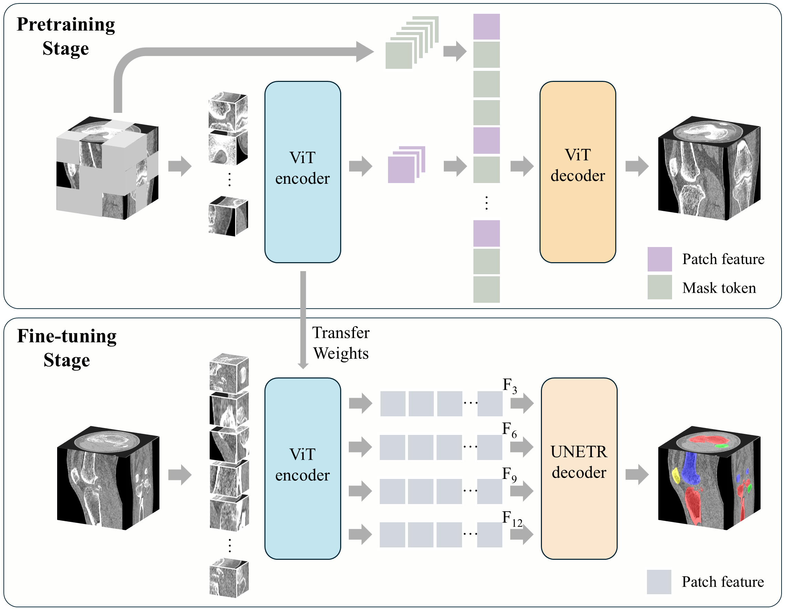

# Learning Generalizable Features for Tibial Plateau Fracture Segmentation Using Masked Autoencoder and Limited Annotations

Implementation of the paper:

**"Learning Generalizable Features for Tibial Plateau Fracture Segmentation Using Masked Autoencoder and Limited
Annotations"**  
Accepted at *IEEE EMBC 2025*

## 📄 Paper

https://arxiv.org/abs/2502.02862

## 🧠 Method Overview

Accurate segmentation of tibial plateau fractures (TPF) from CT scans is highly challenging due to complex fracture
patterns and the need for expert-level annotations. To address these challenges, our method introduces a novel training
strategy based on masked autoencoders (MAE) for semi-supervised TPF segmentation.

The proposed approach consists of two stages:

- **MAE Pretraining:** We utilize a masked autoencoder to learn global skeletal structure and fine-grained fracture
  details from large amounts of unlabeled CT scans. This self-supervised stage enables the model to capture both
  anatomical context and subtle fracture cues.

- **Fine-tuning with Limited Annotations:** The pretrained model is then fine-tuned using a small set of labeled data (
  only 20 cases), significantly reducing annotation requirements while maintaining high segmentation performance.



Our strategy improves the model's ability to generalize across different fracture morphologies and datasets. Experiments
on a proprietary dataset of 180 TPF CT scans show that our method achieves superior performance compared to existing
semi-supervised approaches, with a Dice score of **95.81%**, ASSD of **1.91mm**, and 95HD of **9.42mm**. Furthermore, it
demonstrates strong transferability to other fracture types, such as hip fractures in a public pelvic CT dataset,
indicating its broader applicability in orthopedic image analysis.

### 📊 Segmentation Results on Tibial Plateau Fracture (TPF) CT Dataset

The table below presents the numerical segmentation results of different methods for tibial plateau fractures (Mean ±
SD). Best results are highlighted in **bold**.

| Method          | Labeled Data | DSC (%) ↑        | ASSD (mm) ↓     | 95HD (mm) ↓      |
|-----------------|--------------|------------------|-----------------|------------------|
| Semi-supervised | 20           | 93.54 ± 6.71     | 3.15 ± 4.36     | 17.31 ± 22.57    |
|                 | 10           | 90.68 ± 7.44     | 3.19 ± 3.05     | 18.47 ± 17.92    |
|                 | 5            | 87.61 ± 9.60     | 7.67 ± 5.16     | 51.02 ± 26.94    |
| **Ours**        | 20           | **95.81 ± 5.93** | **1.91 ± 3.64** | **9.42 ± 18.54** |
|                 | 10           | 94.15 ± 6.57     | 3.51 ± 5.91     | 14.83 ± 20.11    |
|                 | 5            | 92.90 ± 7.88     | 6.62 ± 6.52     | 32.31 ± 27.52    |

## 🚀 Getting Started

### 1. Clone the repository

```bash
git clone https://github.com/yuepeiyan/TPFSeg-MAE
cd TPFSeg-MAE
```

### 2. Create environment and install dependencies

```bash
pip install -r requirements.txt
```

### 3. Pretrain

```bash
CUDA_VISIBLE_DEVICES=0 python main.py configs/pretrain.yaml
```

### 4. Finetune

```bash
CUDA_VISIBLE_DEVICES=0 python main.py configs/finetune.yaml
```

<!-- ## 📌 Citation
If you find this work helpful, please cite our paper:

```bibtex
@inproceedings{your_citation_key,
  title={Your Paper Title},
  author={Your Name and Others},
  booktitle={Proceedings of the IEEE Engineering in Medicine and Biology Conference (EMBC)},
  year={2025}
}
``` -->

## 📬 Contact

For any questions or issues, feel free to contact:

**Peiyan Yue** – [2410247007@mails.szu.edu.cn]  
Or open an issue on this GitHub repository.

